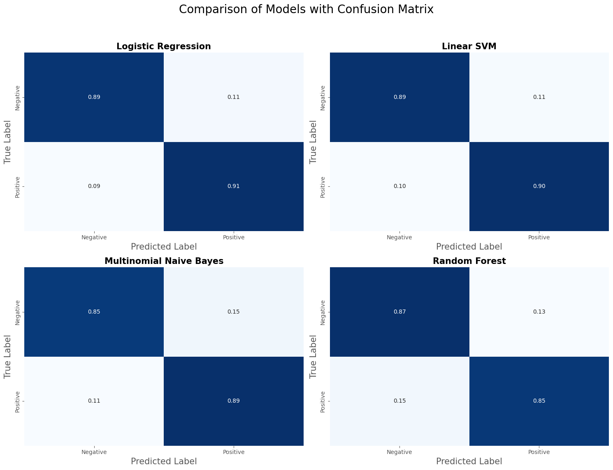
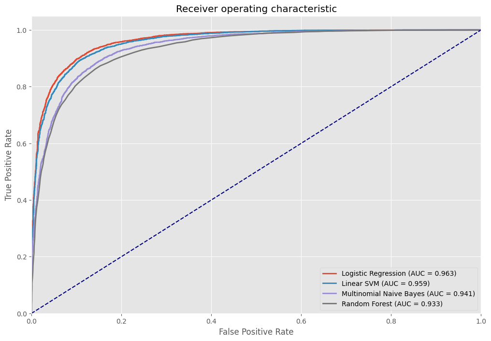

# 🎬 IMDB Movie Review Sentiment Analysis with ML Benchmarking

[](https://www.python.org/)
[](https://scikit-learn.org/)
[](https://github.com/RumeysaHilal/sentiment_analysis_project)

This project is a comprehensive Machine Learning solution for **Sentiment Analysis** on the IMDB Movie Reviews dataset. It benchmarks four different classification algorithms to find the optimal model and includes a **multilingual inference pipeline** capable of translating non-English reviews for real-time sentiment prediction.

## 📌 Project Overview

The goal of this project is to classify movie reviews as either **Positive** or **Negative**. The pipeline includes advanced text preprocessing, TF-IDF vectorization, and a comparative analysis of multiple algorithms.

**Key Features:**
* **Text Preprocessing:** HTML tag removal, regex cleaning, stopword removal (NLTK).
* **Vectorization:** TF-IDF (Term Frequency-Inverse Document Frequency) with top 5,000 features.
* **Model Benchmarking:** Comparison of Logistic Regression, Linear SVM, Multinomial Naive Bayes, and Random Forest.
* **Advanced Evaluation:** Confusion Matrix Heatmaps and ROC/AUC Curve visualizations.
* **Multilingual Support:** Integration with `deep-translator` to handle and classify reviews in languages other than English (e.g., Turkish, Spanish).

## 📂 Dataset

* **Source:** [IMDB Dataset of 50K Movie Reviews](https://www.kaggle.com/lakshmi25npathi/imdb-dataset-of-50k-movie-reviews)
* **Size:** 50,000 Reviews (Balanced: 25k Positive, 25k Negative)
* **Split:** 80% Training, 20% Testing

*Note: The dataset file `IMDB_Dataset.csv` is included in the repository.*

## 🛠️ Technologies Used

* **Language:** Python
* **Data Manipulation:** Pandas, NumPy
* **Machine Learning:** Scikit-learn
* **NLP:** NLTK
* **Visualization:** Matplotlib, Seaborn
* **Translation:** Deep-translator

## 🚀 Installation

Follow these steps to set up the project locally:

1.  **Clone the repository:**
    ```bash
    git clone [https://github.com/RumeysaHilal/sentiment_analysis_project.git](https://github.com/RumeysaHilal/sentiment_analysis_project.git)
    cd sentiment_analysis_project
    ```

2.  **Install the required packages:**
    You can install the necessary libraries using pip:
    ```bash
    pip install pandas numpy scikit-learn nltk seaborn matplotlib deep-translator
    ```

## 💻 Usage

1.  Open the Jupyter Notebook file:
    ```bash
    jupyter notebook main.ipynb
    ```
    *Alternatively, you can upload `main.ipynb` and `IMDB_Dataset.csv` to Google Colab.*

2.  Run all cells in the notebook to:
    * Load and preprocess the data.
    * Train the models.
    * View the performance metrics and visualizations.
    * Test the custom prediction function with your own sentences.

## 📊 Model Performance Results

After training and evaluating four models, **Logistic Regression** achieved the highest accuracy, followed closely by Linear SVM.

| Model | Accuracy | F1 Score | Precision | Recall |
| :--- | :---: | :---: | :---: | :---: |
| **Logistic Regression** | **88.99%** | **0.89** | 0.88 | 0.90 |
| Linear SVM | 88.29% | 0.88 | 0.87 | 0.89 |
| Multinomial NB | 85.57% | 0.85 | 0.85 | 0.86 |
| Random Forest | 85.03% | 0.84 | 0.85 | 0.83 |

*Note: Logistic Regression was selected as the production model due to its superior accuracy and inference speed.*

## 📈 Visualizations

The project generates the following plots to evaluate model performance:

1.  **Confusion Matrix Heatmap:** To visualize True Positives vs False Positives across all models.
    

2.  **ROC Curve:** Comparing the AUC (Area Under Curve) scores.
    
